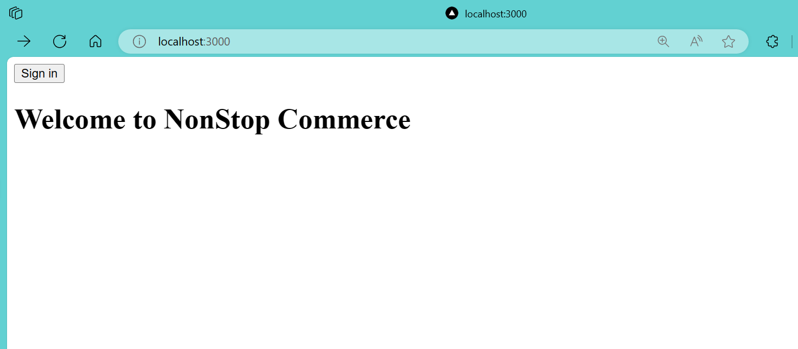
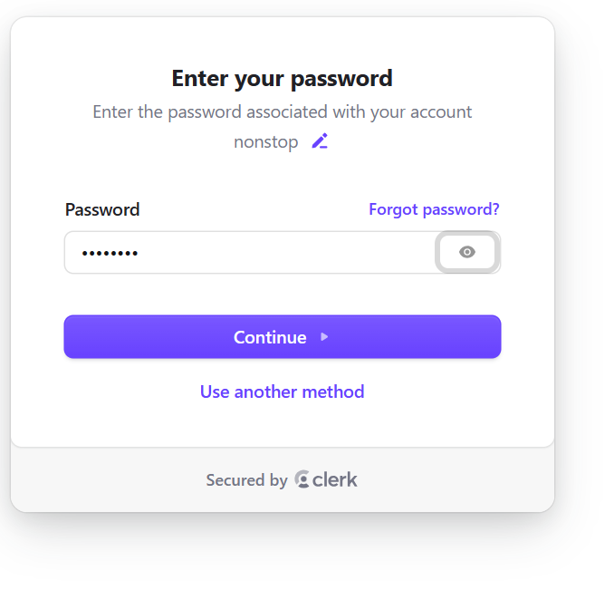
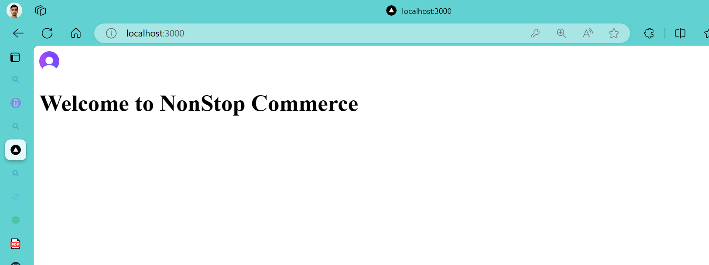
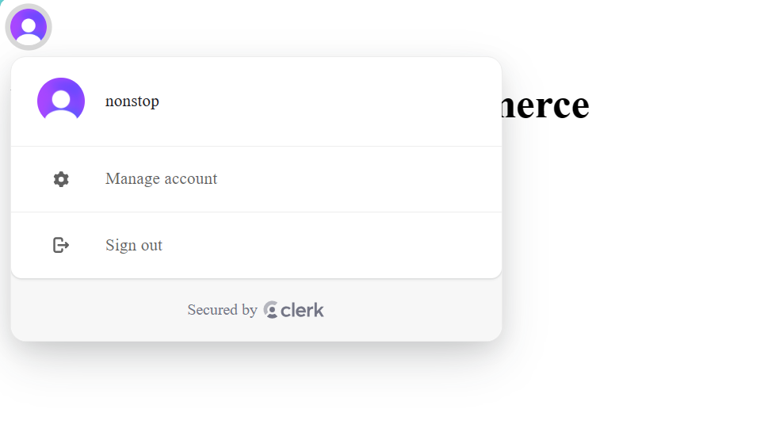
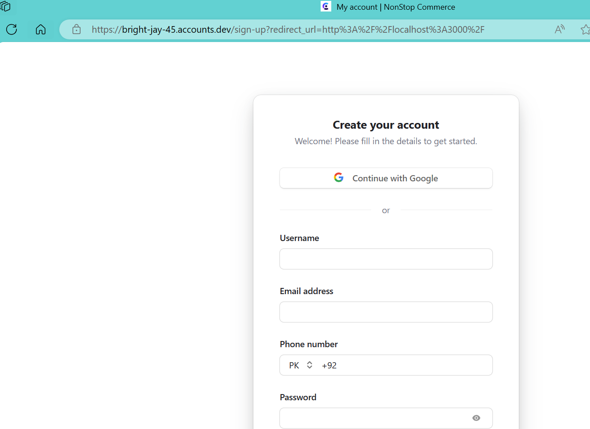
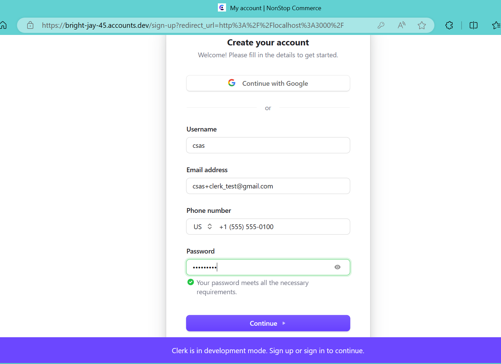
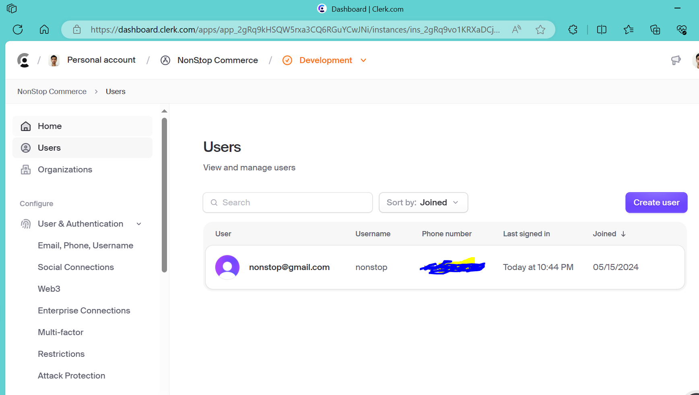

## HomePage

  
   

## SignIn
  
   

## Password
  
   

  ## Signin Successfull
  
   

  ## User Profile
  
   

  ## SignUp Profile
  
   

  ## SignUp Data
  
   

  ## Manage Users
  
   
  
   
  

